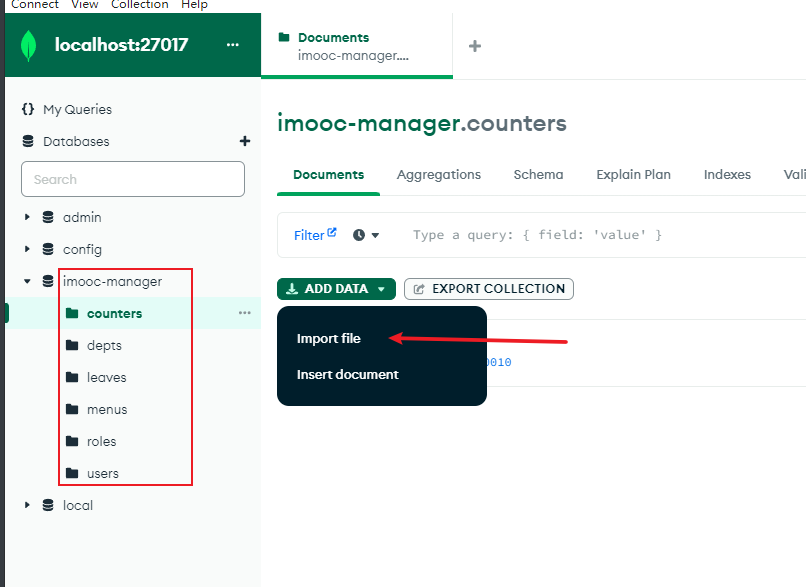

# Vue3+element-plus+koa2+mongoDB 全栈后台管理

- 知识点&数据库表结构&接口文档 见/doc下文档
- 此为前端代码仓库 对应 [后端代码](https://github.com/xiaolinzi7118/Vue3-manage-server)

---

## 运行步骤

- git clone 前端和后端代码

```
git clone https://github.com/xiaolinzi7118/vue3-manage-web.git
git clone https://github.com/xiaolinzi7118/Vue3-manage-server.git
```

- 启动mongoDB服务以及使用mongoDB compass可视化界面操作数据库（见/doc下文档步骤）
- 建立数据库以及相关集合 导入初始JSON数据（见后端代码库mongoJson文件），连接数据库地址见/config/index.js



- 启动前后端项目
